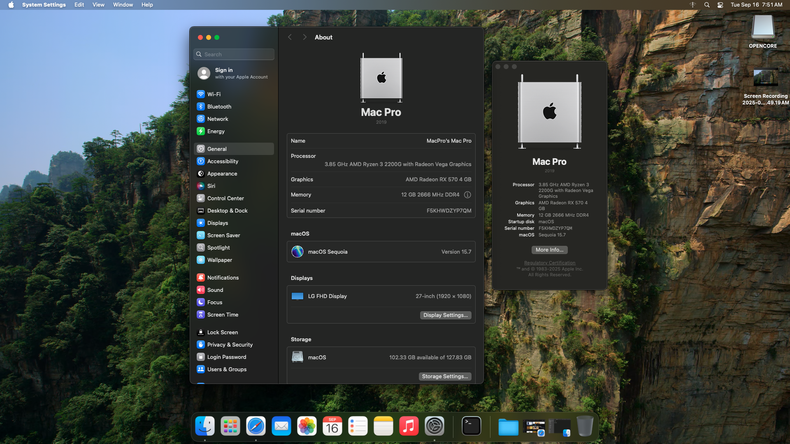

# Hackintosh for Ryzen 3 2200G + RX 570 + ASUS B450M-A-II  
**macOS Sequoia 15.7** - OpenCore EFI

---

## System Specifications

| Component      | Details                          |
|----------------|---------------------------------|
| CPU            | AMD Ryzen 3 2200G               |
| GPU            | Radeon RX 570 4GB               |
| Motherboard    | ASUS B450M-A-II                 |
| RAM            | 12GB DDR4 2666MT/s              |
| Storage        | 128GB NVMe SSD (macOS), SATA SSD + HDD (Windows dual boot) |

---

## Overview

This is my Hackintosh setup running macOS Sequoia 15.7 on AMD Ryzen 3 2200G with Radeon RX 570 graphics, using the OpenCore bootloader. This repo contains my working EFI folder, config, and required kexts for this hardware configuration.

---

## What Works

- **CPU:** Full functionality with AMD Ryzen kernel patches  
- **GPU:** Radeon RX 570 hardware acceleration and Metal support  
- **Audio:** Built-in audio works via patched AppleALC  
- **Sleep/Wake:** Working sleep and wake with no crashes  
- **USB:** USB ports mapped and functional  
- **Dual Boot:** macOS and Windows accessible from OpenCore boot menu  
- **Other:** System updates, iMessage etc

---

## What Doesn’t Work / Known Issues

- **Bluetooth:** Depends on external device; no internal Bluetooth support included
- **Wifi:** Some USB wifi card works (Refer to OpenCore guide)
- **Sleep Issues:** Rare freezes on longer sleep cycles (very occasional)  
- **Others:** Will update this in future

---

## How to Use This EFI

1. Backup your current EFI  
2. Copy the EFI folder from this repository to your EFI partition  
3. Customize `config.plist` for your serial numbers and SMBIOS using tools like GenSMBIOS  
4. Boot with OpenCore  
5. Troubleshoot using verbose mode (`-v` boot argument) if needed

---

## References

- OpenCore Vanilla Guide: https://dortania.github.io/OpenCore-Install-Guide/  

---

## Screenshot

*Last Updated: September 2025*

